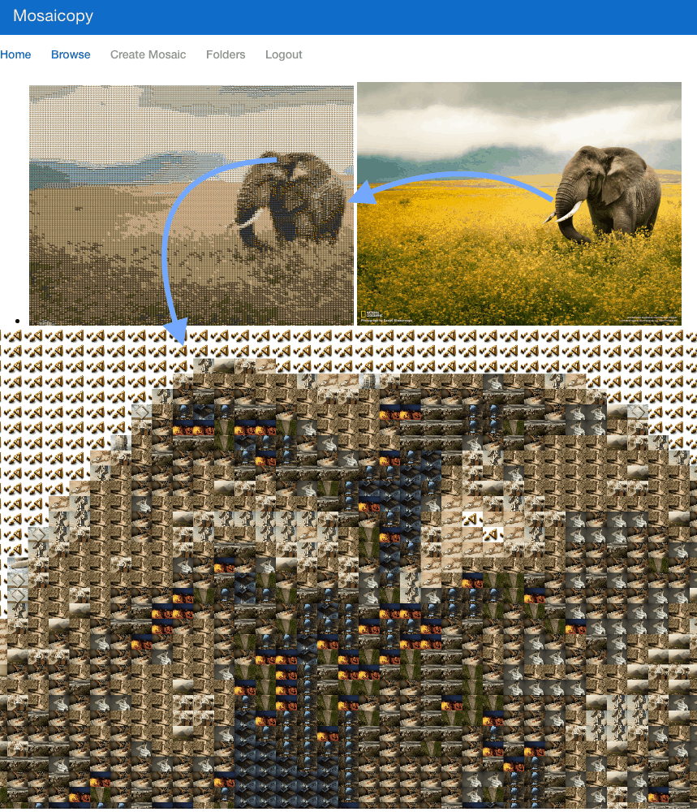

# mosaicopy




# docker run

```
| => docker-compose up
```

Open browser
```
open localhost
```

# manual running
## backend

virtualenv env
. env/bin/activate
pip install -r requirements.txt

$ in folder mosaicopy/backend
### task queue
```
| => celery -A project worker -l debug
```

### webserver
```
| => ./manage.py runserver_plus
```

### create initial folder
```
| => ./manage.py sync_default
```

### create superuser
```
| => ./manage.py createsuperuser
```

## frontend
```
| => npm install
| => npm start
```